# LawAI

## Problem Statement  
Legal professionals often deal with large volumes of documents and complex case data, which are time-consuming to manage, summarize, and analyze manually. There's a need for an intelligent system to simplify legal document workflows.

## Approach & Solution  
LawAI is a Context Management System that empowers lawyers and legal professionals to:  
- Upload and categorize legal documents  
- Automatically summarize long legal PDFs using AI  
- Ask legal questions based on uploaded documents  
- Edit and generate legal documents with formatting assistance  

The solution is built to run locally or on a production server (using Waitress on Windows), with support for remote PostgreSQL databases.

## Features  
- Categorized storage of legal files  
- AI-powered PDF summarization and Q&A  
- Document editing and formatting tools  
- Integration with GeminiAI for intelligent responses  
- Secure user authentication  
- Media and static file management  

## Tech Stack  
- *Backend:* Django 5.2.1  
- *AI Integration:* GeminiAI API  
- *Database:* SQLite (local), Render PostgreSQL (production)  
- *Deployment:* Waitress (Windows)  
- *PDF Conversion:* docx2pdf, pywin32  
- *Styling:* HTML, CSS, Bootstrap  
- *Others:* Whitenoise, dotenv, dj-database-url  

## Screenshots  

###  Login Page
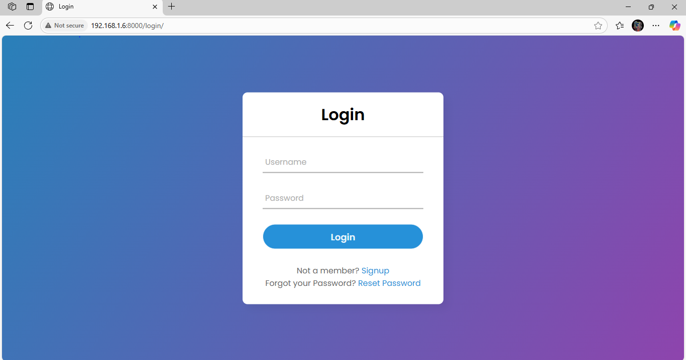

###  New User Registration
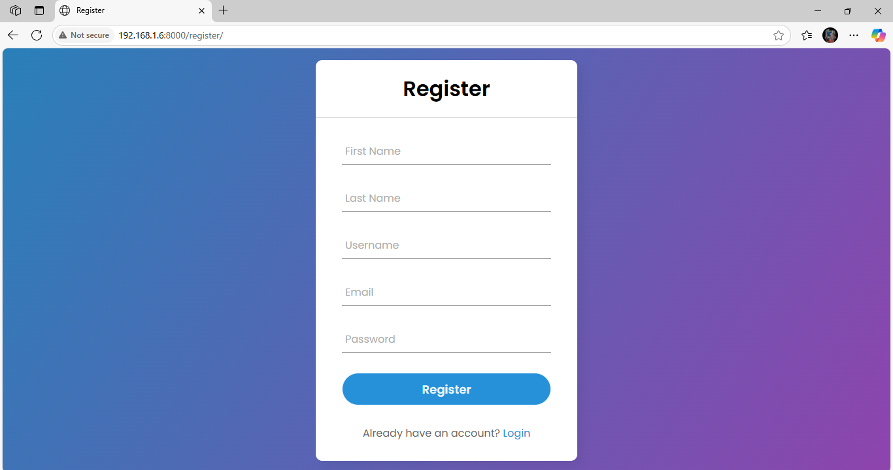

###  Homepage After Login
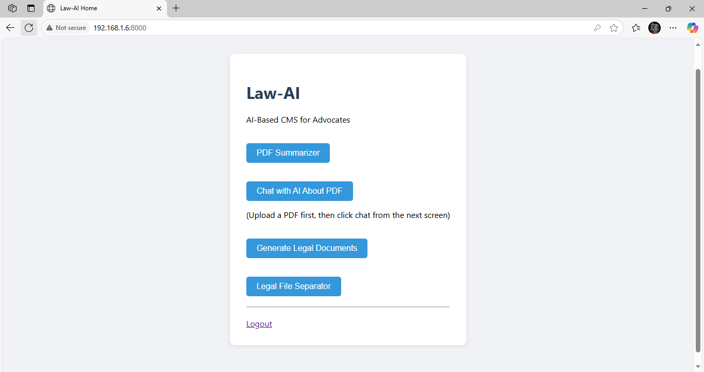

###  Upload Document
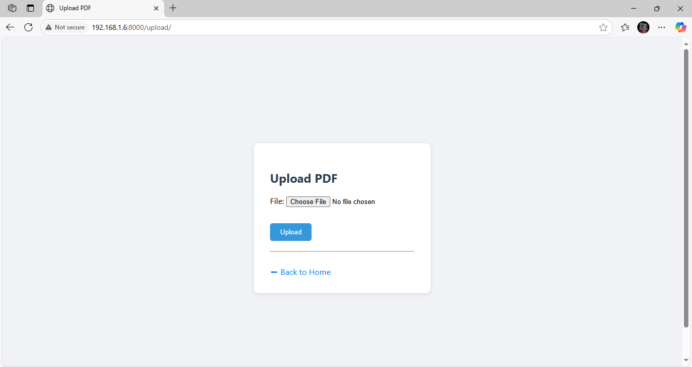

###  Document Selection Page
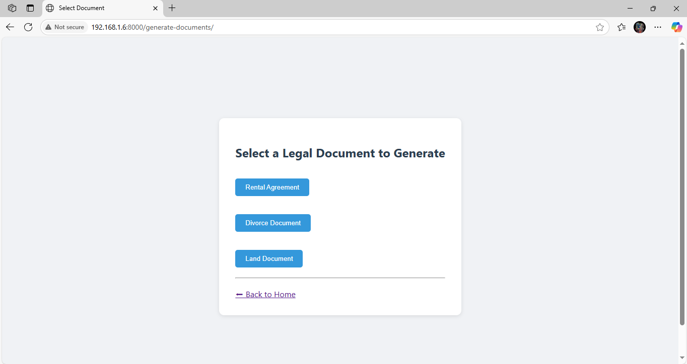

###  Chat with AI – PDF Q&A
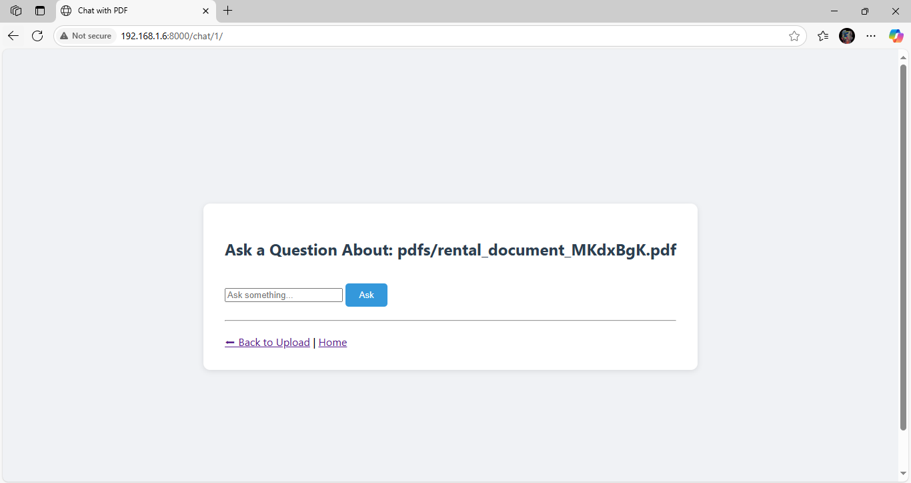

###  AI Response from PDF
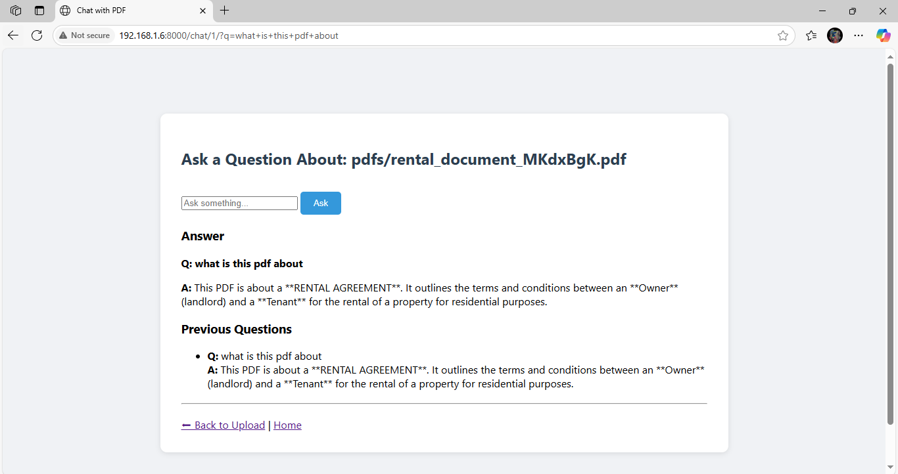  
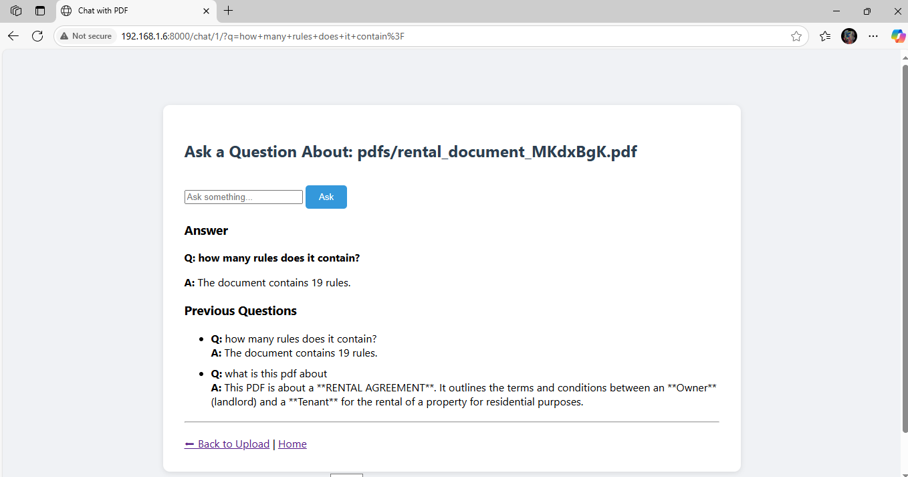

###  Summary Page
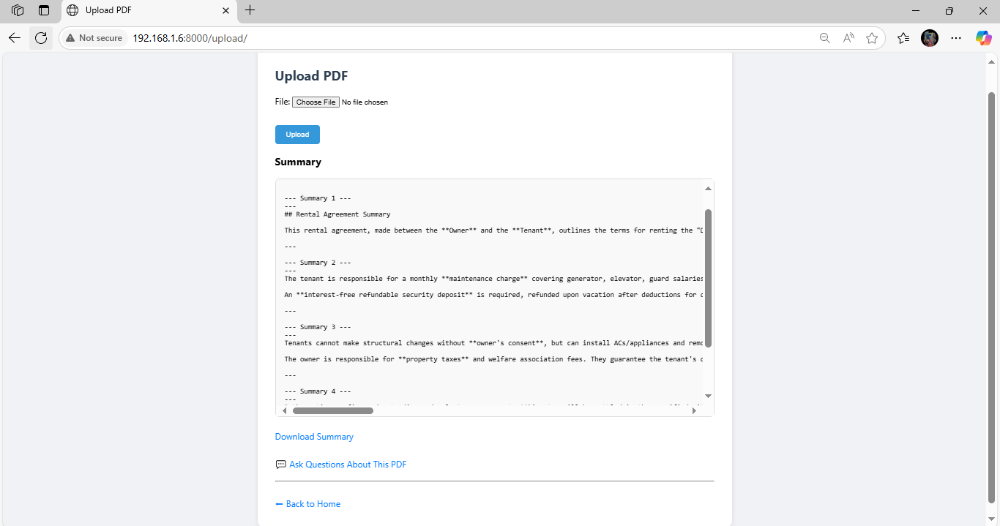

###  Rental Document Generator
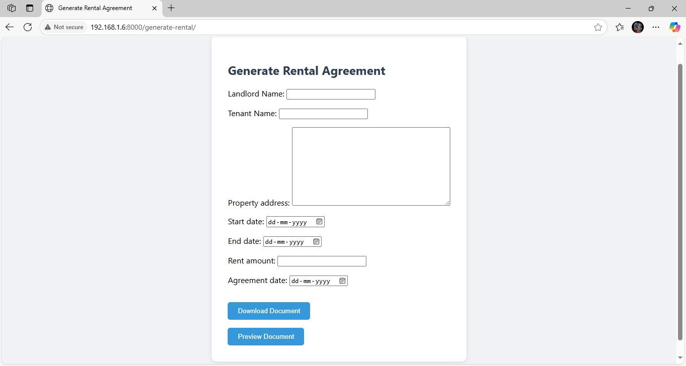  
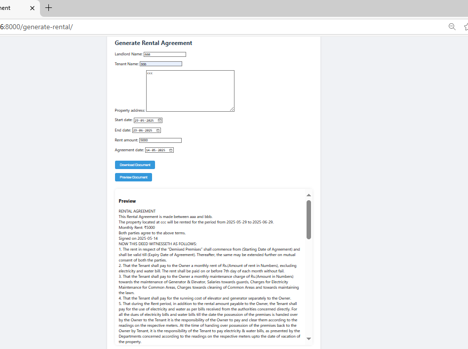

###  Document Separator Page
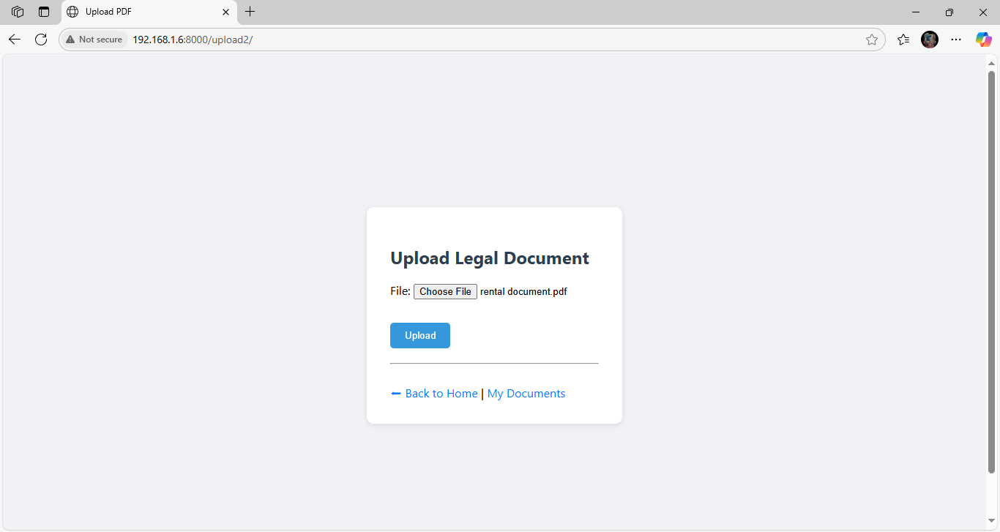  
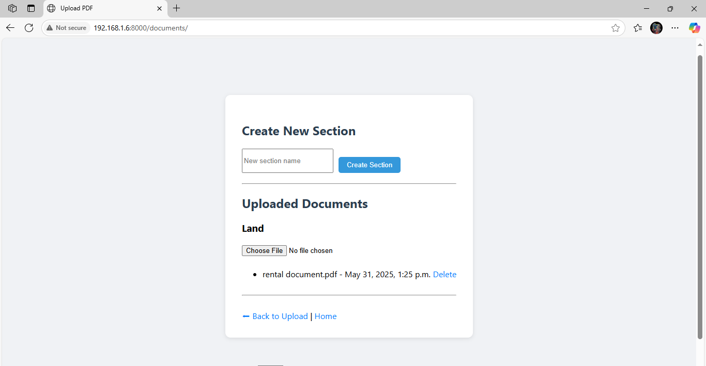

## Run Instructions

### Local Setup
1. *Clone the repo:*
   bash
   git clone https://github.com/Jatinnn557/lawai.git
   cd lawai

2. **Create virtual environment and activate it:**
 bash
python -m venv venv
venv\Scripts\activate

3. *Install dependencies:*
bash
pip install -r requirements.txt

4. **Set environment variables:**
Create a .env file in the root directory with the following:
bash
SECRET_KEY=your_django_secret_key
DATABASE_URL=your_render_database_url
GEMINI_API_KEY=your_geminiai_api_key

5. *Migrate database and collect static files:*
bash
python manage.py migrate
python manage.py collectstatic

6. **Run the server using Waitress:**
Create a server.py file with the following:
bash
from waitress import serve
from lawai.wsgi import application

serve(application, host='0.0.0.0', port=8000)
Then run:
bash
Python server.py

7. **Access the app at:**
bash
http://localhost:8000/
